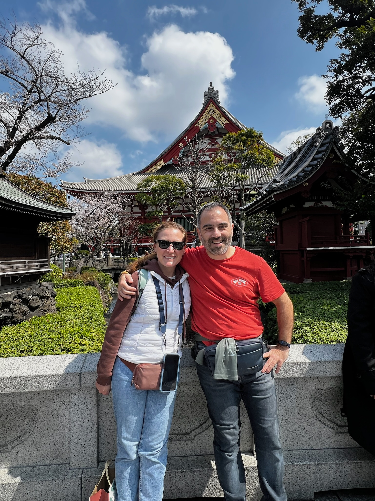

::: story-intro
Every love story is beautiful, but ours is our favorite.
:::

::::: story-block
::: story-image
{fig-align="center"} <!-- Replace with your own photo — recommended size 1000x1200px (portrait) -->
:::

::: story-text
[2019]{.story-year}

### How We Met

It was a rainy Tuesday in October when Nicoletta walked into the campus coffee shop fifteen minutes late for a study group neither of them really needed. Burc had already ordered her favorite drink by accident, mistaking her for someone else — and somehow that mix-up turned into a three-hour conversation about everything except the material they were supposed to be reviewing.

Neither of them remembers a single thing from that exam. They remember everything about that conversation.
:::
:::::

::::: {.story-block .reverse}
::: story-image
{fig-align="center"} <!-- Replace with your own photo — recommended size 1000x1200px (portrait) -->
:::

::: story-text
[2020]{.story-year}

### The First Adventure

Their first real date was supposed to be dinner. It turned into a spontaneous road trip to the coast after Burc mentioned he'd never seen the ocean at sunrise. They drove through the night, arrived just as the sky turned pink, and sat on the hood of the car sharing gas-station coffee and a bag of half-melted chocolate.

It became a tradition. Every anniversary since, they've found a new sunrise to watch together.
:::
:::::

::::: story-block
::: story-image
{fig-align="center"} <!-- Replace with your own photo — recommended size 1000x1200px (portrait) -->
:::

::: story-text
[2023]{.story-year}

### Building a Life Together

Between long work weeks, weekend hikes, and a small apartment that always somehow had too many houseplants, they built something steady and real. They learned each other's coffee orders, favorite songs, and the exact right amount of space to give each other after a hard day.

Somewhere in the middle of all that ordinary, everyday life, they realized they'd found something extraordinary.
:::
:::::

::::: {.story-block .reverse}
::: story-image
{fig-align="center"} <!-- Replace with your own photo — recommended size 1000x1200px (portrait) -->
:::

::: story-text
[2026]{.story-year}

### The Proposal

On a quiet evening walk along the same coastline from their first trip together, Burc got down on one knee just as the sun dipped below the horizon — the same sunrise-chasing spirit that had defined their whole relationship, now closing the loop at sunset.

Nicoletta said yes before he even finished the question.
:::
:::::

::: story-closing
And now, we can't wait to celebrate the next chapter with the people we love most.
:::
