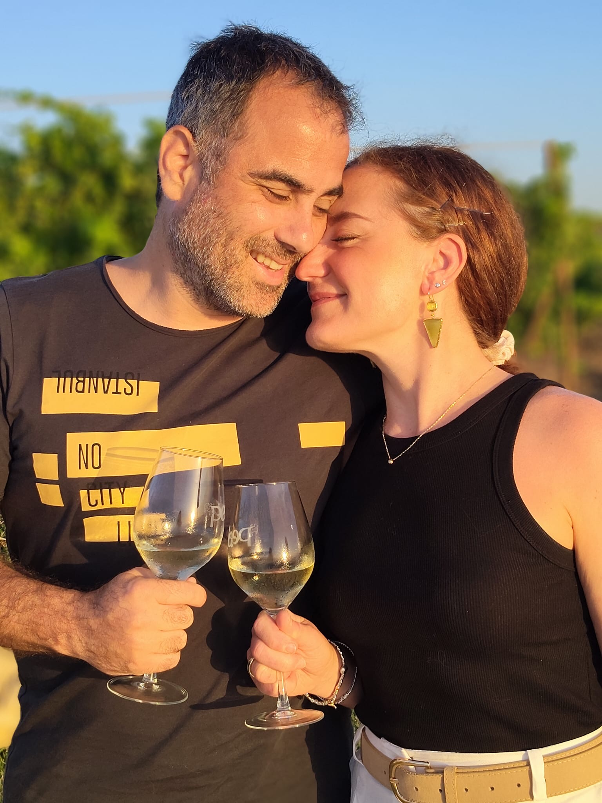
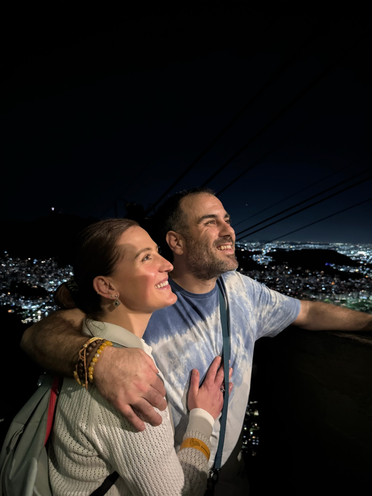
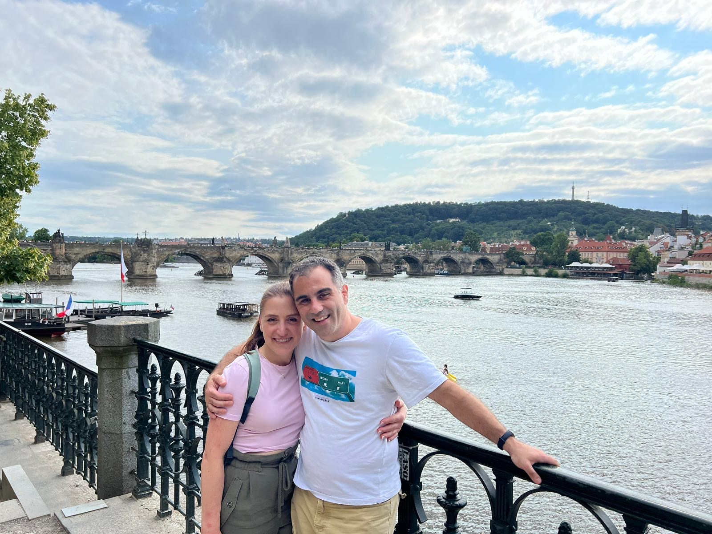
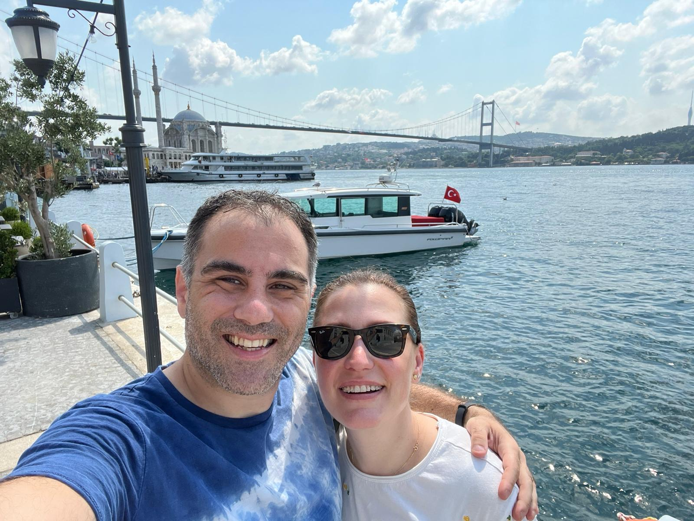
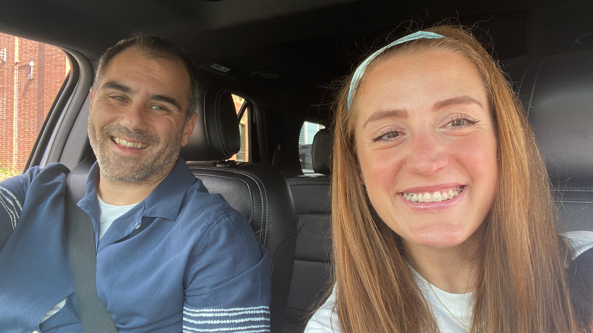
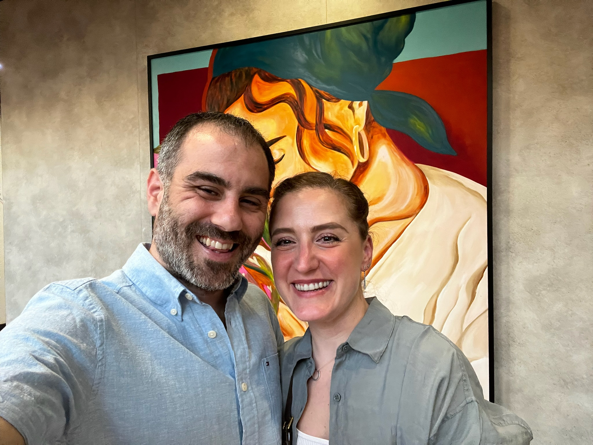
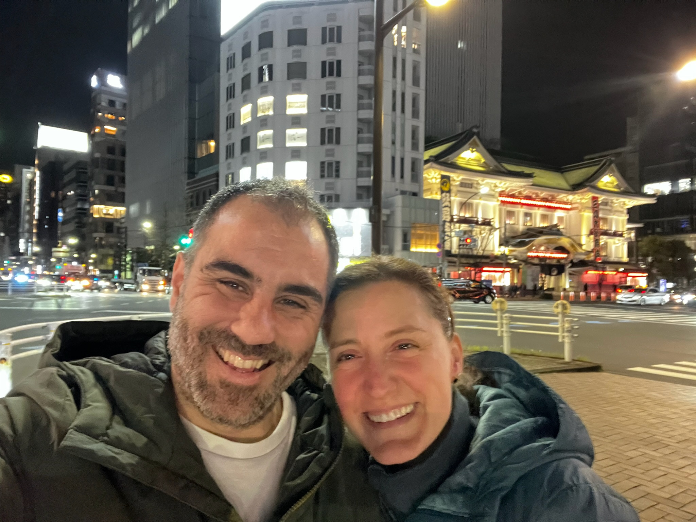
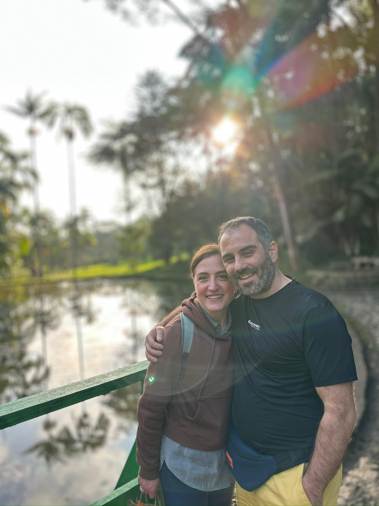

::: story-intro
Every love story is beautiful, but ours is our favorite.
:::

::::: story-block
::: story-image
{fig-align="center"} <!-- Replace with your own photo — recommended size 1000x1200px (portrait) -->
:::

::: story-text
[February 2023]{.story-year}

### How We Met

It was one of those university events where you expect polite small talk and nothing more — until a friend introduced Nicoletta to Burc, and somehow the rest of the night disappeared. We talked for hours, the kind of conversation that makes you forget to check the time, and when it finally ended, it felt too soon. Two days later, an email arrived — a simple invitation for coffee — but coffee turned into dinner, and dinner turned into hours more of talking, tucked into a corner of the Library Pub in Wolfville, as if neither of you wanted the night to end again. Looking back, that was the moment two strangers at a university event quietly became the start of something.
:::
:::::

::::: {.story-block .reverse}
::: story-image
{fig-align="center"} <!-- Replace with your own photo — recommended size 1000x1200px (portrait) -->
:::

::: story-text
[2023]{.story-year}

### The First Adventure

For our first real adventure together, we escaped to a quiet cottage on a lake near Annapolis Royal, wrapped in the stillness of an Easter holiday. The days moved slowly and sweetly — wandering through the natural landscape hand in hand, tasting our way through Scottish flavors, and losing track of time over board games that turned into laughter-filled competitions. Evenings folded into cozy nights, movies glowing on the screen while popcorn and ice cream disappeared between shared glances. It was simple, unhurried, and completely ours — the kind of trip that quietly taught us how easy it was to be happy together.
:::
:::::

::::: story-block
::: story-image
{fig-align="center"} <!-- Replace with your own photo — recommended size 1000x1200px (portrait) -->
:::

::: story-text
[2024]{.story-year}

### Building a Life Together

Between lectures and long days in university, we found something rare: a partnership that felt like it lived both inside and outside the classroom. As university professors, we understood each other's world in a way few others could. But it was outside those walls where we truly came alive together, chasing a passion for travel that turned every year into a new chapter. Since the night we met, we've wandered the cobblestone streets of Prague, lost ourselves in the vibrant chaos of Turkey, danced through the warmth of Brazil, and savored the golden light of Portugal. We've stood beneath cherry blossoms in Japan, shared plates of pasta in Italy, swum in the impossibly blue waters of Greece, explored the sun-soaked flavors of Mexico, and drifted through the turquoise calm of the Bahamas. In the US, Miami became our own — a city of warm nights and easy rhythm we returned to like an old friend. Each place taught us something new — not just about the world, but about each other — and with every stamp in our passports, we built something more than memories. We built a life stitched together by curiosity, discovery, and the quiet joy of exploring it all side by side.
:::
:::::

::::: {.story-block .reverse}
::: story-image
{fig-align="center"} <!-- Replace with your own photo — recommended size 1000x1200px (portrait) -->
:::

::: story-text
[June 3, 2026]{.story-year}

### The Proposal

I thought it was just another dinner with friends — Burc had mentioned they'd be joining us, and I thought nothing of it as we made our way to a beautiful restaurant in Palermo, perched above the sea. The view alone was breathtaking, golden light spilling across the water as the evening settled in. But as we sat down, Burc explained that our friends had cancelled at the last minute — a small disappointment that quickly dissolved into something else entirely, though I had no idea yet just how intentional that "cancellation" had been. Then, as dinner came to its quiet, perfect end, Burc rose from the table and knelt before me, speaking the words in Italian, his voice steady despite the moment trembling around us. He reached into his pocket and drew out the ring, and in his other hand, a bouquet of red roses waited, as if even he couldn't decide which to offer first. In that instant, Palermo, the sea, the candlelight — all of it faded into the background of the only thing that mattered: saying yes to forever with him.
:::
:::::

::: {.story-gallery}

:::

::: story-closing
And now, we can't wait to celebrate the next chapter with the people we love most. **We're getting married!**
:::