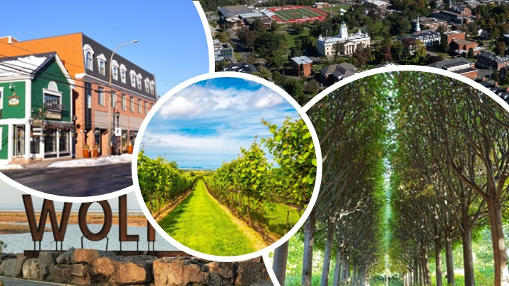

::::::::::: travel-page
::: travel-intro
:::

## Getting There

::: travel-section
**By Air**

The closest airport is **Halifax Stanfield International Airport (YHZ)**, about a 50-minute drive from Wolfville, Nova Scotia.

**By Car**

If you're driving, Wolfville sits just off **Highway 101**, roughly an hour from Halifax. We'd recommend renting a car at the airport — it's the easiest way to get around the valley for the wedding weekend and beyond.
:::

## Where to Stay

We've pulled together a few options at different price points, all within a short drive of the venue. We recommend booking early — Wolfville is a small town and rooms fill up fast in the summer!

::::::: hotel-grid
::: hotel-card
#### The Old Orchard Inn

*\~10 minutes from the venue*

A comfortable, mid-range option just outside town, with an on-site restaurant and pool.

[Book Now](https://oldorchardinn.com){.btn-dark target="_blank"}
:::

::: hotel-card
#### Blomidon Inn

*\~5 minutes from the venue*

A charming heritage inn right in Wolfville, walking distance to shops and restaurants downtown. Boutique-style rooms, a bit more upscale.

[Book Now](https://www.blomidon.ns.ca){.btn-dark target="_blank"}
:::

::: hotel-card
#### Tattingstone Inn

*\~7 minutes from the venue*

A cozy bed & breakfast with a garden courtyard — a quieter, more intimate option for those who prefer a smaller property.

[Book Now](https://www.tattingstoneinn.com){.btn-dark target="_blank"}
:::

::: hotel-card
#### Local Airbnbs

*Varies*

For larger groups or families traveling together, the Wolfville and Grand Pré area has a wide range of Airbnb houses and cottages, many with vineyard views.

[Browse Options](https://www.airbnb.ca){.btn-dark target="_blank"}
:::
:::::::

## Getting Around

::: travel-section
Wolfville is a small, walkable town, but the wedding venue is a short drive outside the downtown core. We'd suggest renting a car for the weekend, though we're also happy to help coordinate carpools — just reach out if you'd like to be connected with other guests staying nearby.
:::

{fig-align="center"}
:::::::::::
